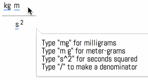

The goal is to implement <a href="http://phabricator.khanacademy.org/T3077">T3077</a>     - unit selector widget. At first glance it seems to make sense to just include a `<select>` on each side.

However, this fails in a few ways.

* Sometimes we want a denominator, sometimes we don't. However, we don't want to include a `<select>` for both numerator and denominator all the time. This might make it seem like the user has to use both when that's not really the case.
* How do we handle prefixes? Meters can have prefixes like "m", "c", "k", etc. Another `<select>`?
* The numeric input and the unit input need to be tied so we can accept either 100 cm or 1 m, for example.

We decided to instead build a keyboard input that

* groups the characters 'k' and 'g' together to form "kg", unless you want them to be separate units "m" and "g".
* splits into numerator and denominator when you press "/"
* may be a hybrid like the expression widget, where there are buttons you can press to input a unit

Should the system have knowledge of the units we allow and the prefixes that can be applied to them? It would be simpler to allow users to enter anything - e.g. "(asfd)^2(fdsa)". But with knowledge of units we could warn the user that we won't recognize the thing they entered.

There's a more important benefit from having unit knowledge. There are some answers which could be reasonably expressed in terms of different units. Examples:

* 500 m = 0.5 km
* 1 m/s^2 = 1 N/kg
* 1 mL = 1 mm^3

I'm tempted to push this back to v2 of the unit selector:

* It's unclear which unit conversions we should be willing to do
  - The m <-> km conversion seems like the right thing to do 99% of the time
  - The m/s^2 <-> N/kg conversion seems like the right thing to do 90% of the time
  - ... But the same value expressed in (N^2)(s^2)/(kg^2)m is always wrong (what are the rules for simplification?)
  - The mL <-> mm^3 conversion seems like he right thing to do 80% of the time
  - You could express the same temperature in K, °C, or °F; but we probably rarely want to do that conversion
* So it seems likely that we'll require exercise writers to specify acceptable units
  - at this point we could probably convert from a canonical expression written in terms of one unit to whatever unit the user uses
  
There are a few more difficulties which haven't been covered yet.

* Is capitalization important? Some units are customarily capitalized (L), while others aren't (m). Should we only accept the usual capitalization, both, or special-case each unit?
* µ, Å, and ° are hard to type. We should accept u, A, and degree.
* Some prefixes are uncommon and probably shouldn't be accepted even though they're equivalent to the correct answer.
* Some units have two different abbreviations - e.g. "kn" and "kt" both mean "knot"

Resources:

* This [library](https://github.com/gentooboontoo/js-quantities/blob/master/src/quantities.js) looks useful.
* [Helps' list](https://docs.google.com/a/khanacademy.org/document/d/1Gzzw5k4XWQr6wcPioHlsokkZqSkl3W_3No6NSDNTwnE/edit#heading=h.7b7ur5od0kuk) of units we should support

To summarize (you don't need to read this - it's more of a checklist for Joel):

* we can't use a native input, must create our own cursor and interpret
  keystrokes
* distinguishing between (m)(g) and (mg)
* user starts with just numerator, can type "/" to get denominator
* angstrom, micro-, and degree are hard to enter / must be inferred from lookalike
  letters
* the numeric input and unit input must be tied together so it's possible to
  accept an answer expressed in either m or cm, for instance
* the system must additionally have an understanding of equivalent units
  - N = kg*m/s^2
  - mL = mm^3
* however, it can't accept all equivalent units - it would not be acceptable
  to use N*s^2/kg instead of m
* case may or may not be important. i think a lot of units are recognized with either capitalization, but that's probably not always the case.
* prefixes may or may not be okay
  - only SI units use them
  - even then, some aren't really used. "cm" is common. "cL"? nah.
* some units have multiple abbreviations